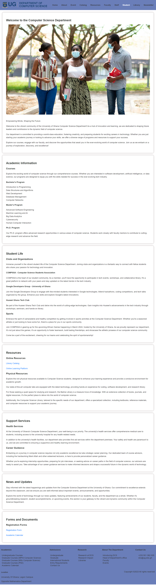

# DCIT_205_IA

# Computer Science Department Website

## Introduction

Welcome to the Computer Science Department's official website! This platform serves as a hub for information related to our department, including courses, faculty details, and important announcements.

## Purpose

The primary purpose of this website is to provide a user-friendly interface for students, faculty, and visitors to access relevant information about the Computer Science department. Whether you're seeking course details, faculty profiles, or the latest department news, you'll find it all here.

## Setup Instructions

To clone and set up the project, follow these steps:

1. **Clone the Repository:**
   ```bash
   git clone https://github.com/steveAzo/11027858_DCIT_205.git


## Setup Instructions

1. **Clone the Repository:**
   ```bash
   git clone https://github.com/steveAzo/11027858_DCIT_205.git
Navigate to the Project Directory:

Navigate to the Project Directory:
cd your-repo

Install Dependencies:
npm install

Run the Application:
npm start

## Author

- **Name:** Azongo Stephen Kwaku
- **Student ID:** 11027858

## Screenshots

Homepage


About page


Catalog page


Event page


Faculty page


Library page


Resources page


Staff page


Student page


Newsleter page


## What I've Learned

This project has been an enriching learning experience, allowing me to delve into various aspects of web development. Here are some key takeaways:

### 1. Dynamic Webpage Handling with JavaScript

I gained proficiency in using JavaScript to enhance the website's interactivity. Specifically, I implemented functionality to dynamically highlight the active webpage, providing users with a seamless and intuitive navigation experience.

### 2. Organized Styling with CSS

I learned the importance of maintaining clean and organized code by structuring my stylesheets using separate CSS files and folders. This practice not only enhances code readability but also facilitates easier maintenance and scalability.

### 3. Responsive Design Principles

Implementing responsive design principles became integral to ensure the website's compatibility across various devices and screen sizes. This involved utilizing CSS media queries and flexible layout techniques to create a visually pleasing experience on both desktop and mobile devices.

### 4. HTML for Structured Content

I honed my skills in creating well-structured HTML, ensuring the content is presented in a clear and accessible manner. This includes organizing information logically, utilizing semantic tags, and adhering to best practices for web accessibility.

### 5. Collaborative Development using Git

The project reinforced the importance of version control with Git, enabling collaborative development and efficient tracking of changes. I became adept at creating branches, merging code, and utilizing pull requests to maintain a streamlined and organized development workflow.

### 6. Continuous Learning and Problem Solving

Throughout the development process, I embraced a proactive approach to problem-solving. Faced with challenges, I researched solutions, sought feedback, and continuously improved my skills. This project served as a platform for ongoing learning and growth in the ever-evolving field of web development.

This journey not only enhanced my technical skills but also instilled a sense of creativity, problem-solving, and attention to detail that will undoubtedly contribute to my future endeavors in web development.


